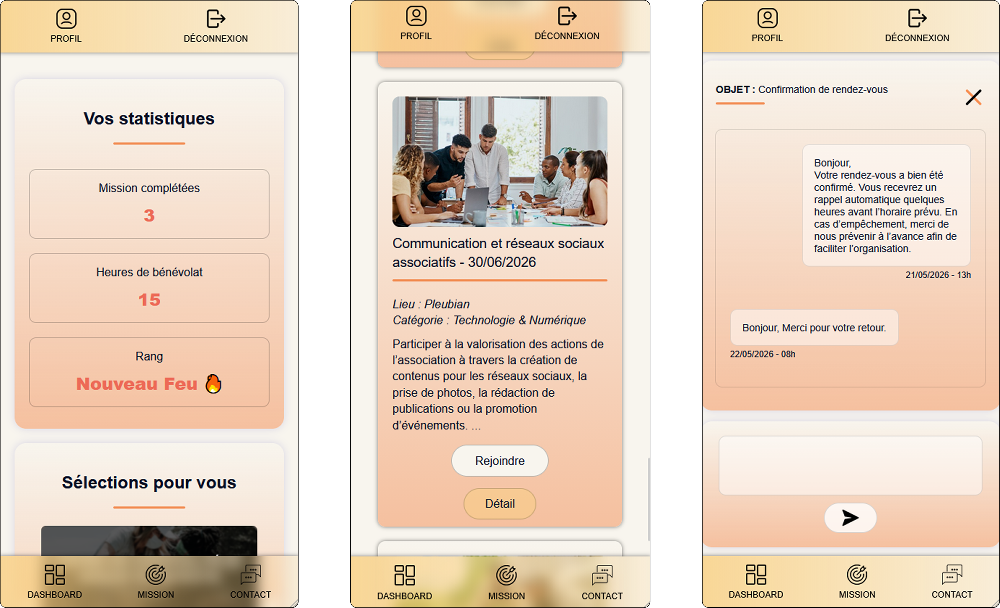
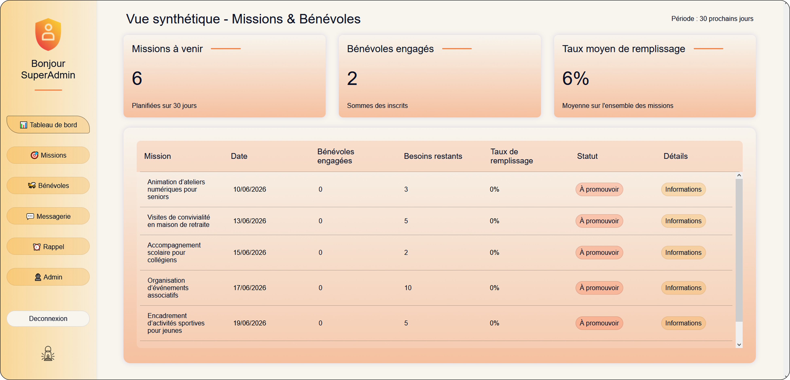
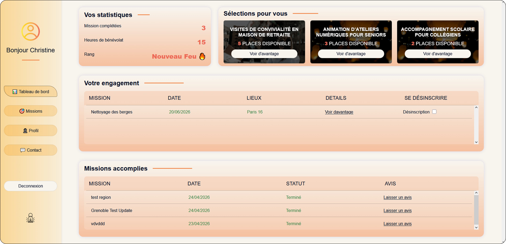

# Les Éclaireurs Solidaires 🤝

**Les Éclaireurs Solidaires** est une plateforme de gestion de missions destinée aux bénévoles d'une association. L'objectif est d'offrir un outil simple et intuitif pour la publication de missions tout en permettant aux volontaires de s'engager et de suivre leurs actions dans le temps.

## 📋 Présentation du Projet
Ce projet "fil rouge" est réalisé dans le cadre de la formation **Développeur Web et Web Mobile** chez **M2i Formation** (2025-2026). Il répond à un besoin de centralisation pour faciliter la communication entre les administrateurs d'une structure associative et ses membres actifs.

### Fonctionnalités clés :
* **Espace Administrateur** : Gestion complète des missions (création, modification, suppression) et supervision de la liste des bénévoles.
* **Espace Bénévole** : Consultation des missions disponibles, filtrage par thématique et accès à un historique d'engagements.
* **Messagerie Interne** : Système de messagerie mis en place pour fluidifier les échanges directs entre les membres de la plateforme.
* **Rappels Automatisés** : Planification de tâches de rappel de missions via **Node-Cron** pour notifier automatiquement les bénévoles.
* **Interface Responsive** : Adaptation du contenu et de la navigation pour les supports mobiles, tablettes et desktop.

> 🏁 **Note :** Ce projet correspond à la version finale livrée pour l'examen. L'application répondant aux exigences du cahier des charges principal, certaines fonctionnalités secondaires ou documentations annexes ont été volontairement laissées de côté ou pourront être intégrées lors de futures évolutions.

## 🛠️ Environnement Technique & Déploiement

### Structure & Frameworks
Le projet est structuré selon une architecture **MVC** (Modèle-Vue-Contrôleur) pour garantir la maintenance et la séparation des responsabilités.

* **IDE** : Visual Studio Code.
* **Back-end** : Node.js avec le framework **Express**.
* **Front-end** : JavaScript Vanilla (avec le moteur de template EJS).
* **Base de données** : MySQL.
* **Gestion de versions** : Git (Workflow : main, dev, feature, tests).

### Environnement de Développement
* **Conteneurisation & Outils** : Docker et Docker Compose (services isolés pour Node.js, l'image **MySQL**, et l'image **phpMyAdmin** pour l'administration graphique de la base de données en local).

### Environnement de Production & Déploiement
* **Hébergement** : Serveur Virtuel Privé (**VPS**) chez **OVHcloud**.
* **Déploiement** : Automatisé via un script shell (`.sh`) pour l'installation, la configuration et la mise en production sur le VPS.

## 📐 Architecture du Projet
L'application suit une architecture **MVC** (Modèle-Vue-Contrôleur), garantissant une séparation des responsabilités et une bonne maintenabilité :

```text
.
└── site
    └── src
        ├── config/          # Configurations globales (Base de données, variables d'environnement)
        ├── controllers/     # Logique métier divisée par domaines
        │   ├── mission/     # Gestion des actions liées aux missions
        │   └── user/        # Gestion des profils et des utilisateurs
        ├── cron/            # Tâches planifiées en arrière-plan (Node-Cron)
        ├── logs/            # Fichiers de suivi et de debug de l'application
        ├── middleware/      # Middlewares de sécurité (Authentification, sessions, sanitization)
        ├── models/          # Modèles MySQL et requêtes SQL préparées
        ├── public/          # Ressources statiques accessibles par le client
        │   ├── javaScript/  # Scripts JS côté client (Vanilla)
        │   ├── pictures/    # Assets visuels organisés par catégories   
        │   └── style/       # Feuilles de style CSS découpées par modules
        ├── routes/          # Définition des points d'entrée et aiguillage des requêtes
        ├── services/        # Services transversaux (Envoi d'emails, traitements tiers)
        ├── utils/           # Fonctions utilitaires et outils d'aide au développement
        └── views/           # Interfaces graphiques (Fichiers EJS)
            ├── account/     # Vues des espaces utilisateurs
            │   ├── admin/   # Interfaces spécifiques à l'Administrateur
            │   └── volunteer/ # Interfaces dédiées aux Bénévoles
            ├── connection/  # Pages de connexion et d'inscription
            ├── home/        # Page d'accueil de la plateforme
            ├── legals/      # Mentions légales et RGPD
            ├── messaging/   # Interfaces du système de messagerie interne
            ├── modals/      # Fenêtres modales contextuelles
            └── partials/    # Composants réutilisables (Header, Footer, Navbar)
```

## 🛡️ Sécurité

La sécurité a été intégrée tout au long du développement de la plateforme, aussi bien côté **Front-End** que **Back-End**, afin de garantir la confidentialité des données, l'intégrité du système et la protection des utilisateurs.

Les principaux mécanismes de sécurité ont été mis en œuvre à chaque niveau de l'application :

* **Protection contre les injections SQL** grâce à l'utilisation de requêtes préparées et paramétrées dans la couche d'accès aux données.
* **Prévention des failles XSS** via l'échappement des données affichées, la sécurisation du rendu des vues EJS et la validation des entrées utilisateur.
* **Validation et assainissement des données** côté client et côté serveur afin de contrôler systématiquement les informations reçues.
* **Authentification et contrôle d'accès** reposant sur une gestion sécurisée des sessions et des vérifications de privilèges sur les routes sensibles.
* **Protection des données sensibles** grâce à la sécurisation des mots de passe, des variables d'environnement et des cookies de session.
* **Gestion des erreurs** adaptée côté client et côté serveur afin d'éviter l'exposition d'informations techniques critiques.

Cette approche permet d'assurer une défense cohérente sur l'ensemble de l'architecture en prenant en compte les principaux risques de sécurité identifiés lors de la conception et du développement du projet.

---

## 📸 Aperçu de l'Interface

> 💡 *Les visuels ci-dessous illustrent l'ergonomie, les fonctionnalités clés et la responsivité de la plateforme finale.*

### 📱 Immersion & Adaptabilité Mobile

| Page d'Accueil (Section Héro) | Interface Mobile (Responsive Design) |
| :---: | :---: |
|  |  |

### 🖥️ Vue Desktop (Tableaux de Bord)

| Espace Administrateur (Gestion & Supervision) | Espace Bénévole (Recherche & Engagement) |
| :---: | :---: |
|  |  |

---

## 👥 Guide d'Utilisation Simplifié

### 🧑‍💼 Espace Administrateur
1. **Connexion** : Connectez-vous avec vos identifiants disposant du rôle d'administration.
2. **Gestion des Missions** : Accédez au panneau de contrôle pour publier une nouvelle mission, modifier les informations d'un événement existant etc...
3. **Modération** : Consultez la liste des membres inscrits pour superviser les accès à la plateforme.

### 🏃‍♂️ Espace Bénévole
1. **Inscription / Connexion** : Créez un compte bénévole ou connectez-vous à votre espace personnel.
2. **Recherche de Missions** : Parcourez le catalogue des missions publiées par l'association et affinez l'affichage grâce aux filtres thématiques.
3. **Engagement & Messagerie** : Rejoignez une mission en un clic et utilisez le système de messagerie interne pour échanger en direct avec les organisateurs.

---

## 🧪 Validation & Tests

Pour garantir la robustesse et la fiabilité de la plateforme, une stratégie de tests a été mise en œuvre durant le développement, combinant plusieurs niveaux de vérification :

* **Tests Unitaires (Jest)** : Implémentés pour valider le comportement isolé des composants, des fonctions utilitaires et de la logique métier de l'application.
* **Tests d'Intégration (Jest)** : Mis en place pour vérifier la bonne communication entre les différentes couches de l'architecture MVC, les middlewares de sécurité et la base de données.
* **Tests End-to-End / E2E (Cypress)** : Réalisés pour simuler des scénarios utilisateurs complets et automatisés directement dans le navigateur, assurant la conformité des parcours critiques.

---

Voici le contenu formaté en Markdown (`README.md`) :

## 🚀 Installation et Déploiement

Le déploiement de l'application est entièrement automatisé grâce à un script Shell. Ce script prend en charge l'intégralité de l'installation : des dépendances système jusqu'à la configuration du pare-feu et du reverse proxy Nginx.

### 1. Prérequis sur le VPS

Avant de lancer le script, assurez-vous simplement de remplir ces trois conditions :

* **Système d'exploitation :** un VPS vierge sous Ubuntu.
* **Privilèges :** disposer des droits `root` ou d'un utilisateur avec accès `sudo`.
* **Configuration du script :** renseignez les variables de configuration définies au début du fichier `.sh`. Le script utilise ces paramètres pour automatiser correctement l'installation et le déploiement.

### 2. Procédure d'exécution

Connectez-vous à votre VPS en SSH, récupérez le script `deploy.sh`, attribuez-lui les droits d'exécution, puis lancez-le :

```bash
# 1. Rendre le script exécutable
chmod +x deploy.sh

# 2. Exécuter le script de déploiement
sudo ./deploy.sh
```

### 3. Déroulement de l'automatisation

Une fois lancé, le script s'occupe de tout. Vous n'aurez qu'une seule intervention manuelle à effectuer pendant le processus :

### Génération de la clé SSH

Le script génère automatiquement une clé SSH sécurisée et l'affiche dans votre terminal.

### Liaison avec GitHub

1. Copiez la clé SSH affichée.
2. Connectez-vous à votre compte GitHub.
3. Rendez-vous dans **Settings → SSH and GPG keys**.
4. Ajoutez une nouvelle clé SSH en y collant la clé générée.

### Validation

Une fois la clé ajoutée à GitHub, revenez dans votre terminal et appuyez sur **Entrée** pour permettre au script de poursuivre automatiquement le déploiement.

---

## ⚙️ Maintenance & Commandes Globales

Suite à l'exécution du script de déploiement sur le VPS, un fichier `DEPLOY_GUIDE.md` est automatiquement généré à la racine du projet afin de regrouper les principales commandes d'administration.

### 🔄 Mise à jour de l'application

```bash
git pull
npm install
pm2 reload les-eclaireurs-solidaires
```

### 🗄️ Réinitialisation de la base de données

```bash
mysql -u root -p les_eclaireurs_solidaires < site/src/config/schema.sql
```

### 📊 Supervision PM2

```bash
pm2 list
pm2 logs
```

### 🌐 Vérification Nginx

```bash
sudo nginx -t
sudo systemctl status nginx
```


---
**Développé par Hugo Delsol** *Formation DWWM - M2i Formation*
